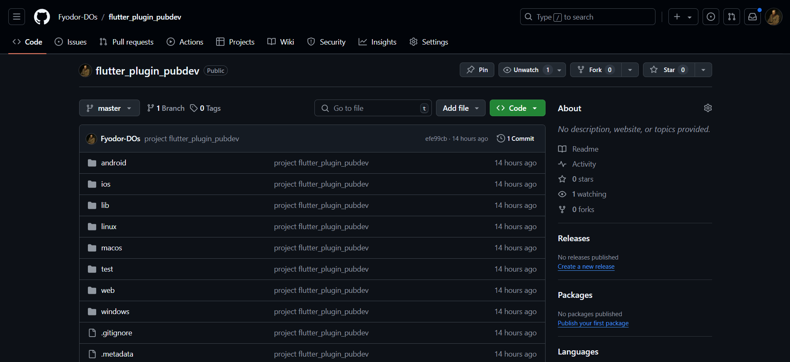
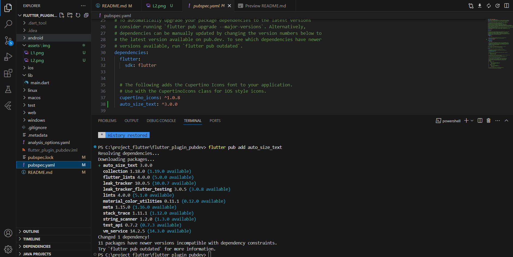
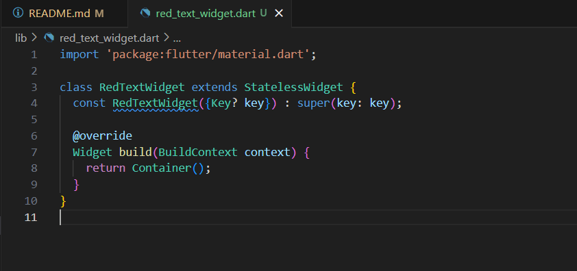
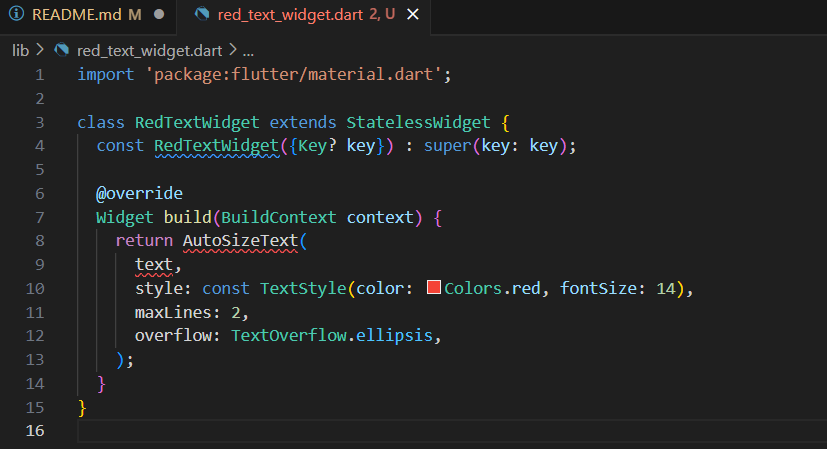
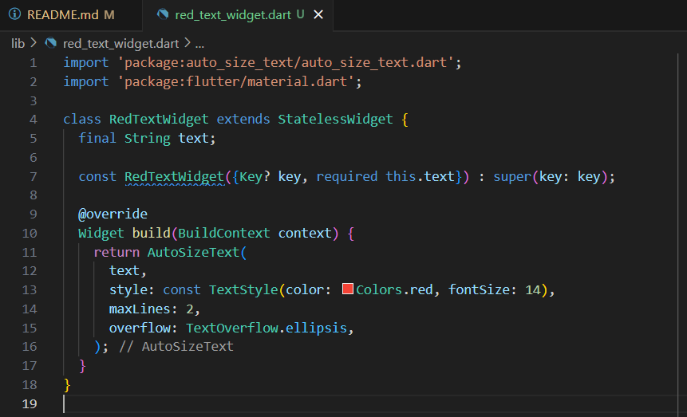
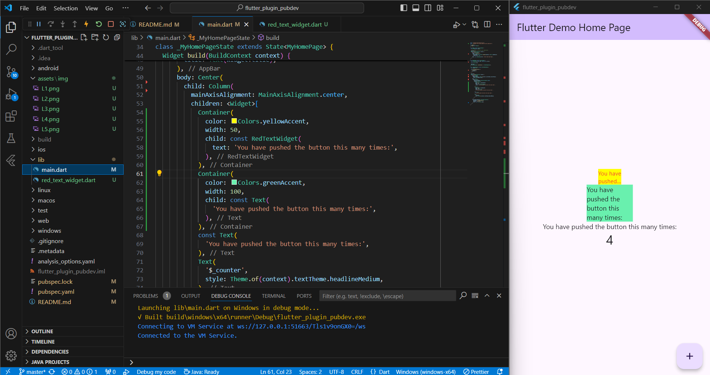

Nama    : Ahmed Fathir Syafaat

Kelas   : TI - 3H

NIM     : 2241720083

# #07 | Manajemen Plugin

## Praktikum

### Langkah 1: Buat Project Baru

### Langkah 2: Menambahkan Plugin

### Langkah 3: Buat file red_text_widget.dart

### Langkah 4: Tambah Widget AutoSizeText

Setelah Anda menambahkan kode di atas, Anda akan mendapatkan info error. Mengapa demikian?

> Karena library auto size text belum ter-import

### Langkah 5: Buat Variabel text dan parameter di constructor

### Langkah 6: Tambahkan widget di main.dart

